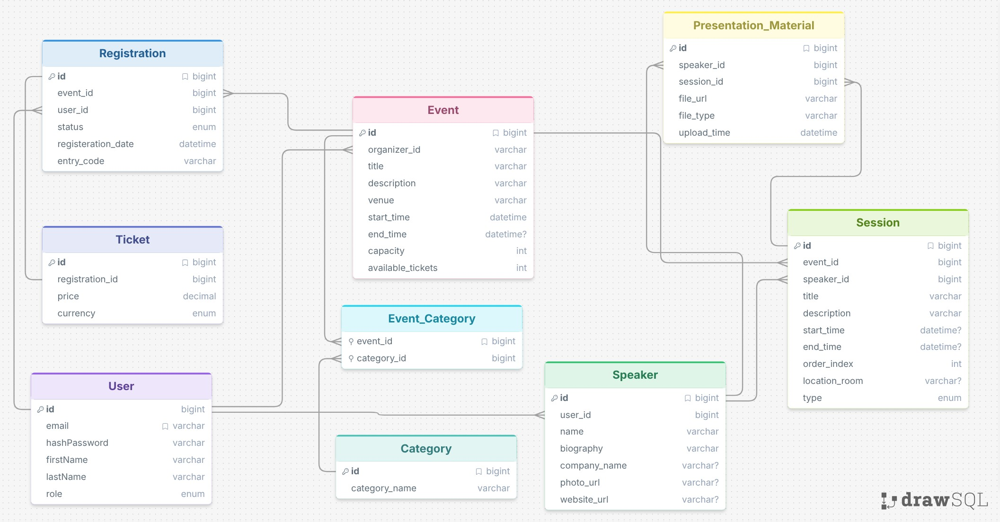

# EventManager

# 1. CRUD Operations

# Authentication
| Method | Endpoint       | Description                     |
|--------|----------------|---------------------------------|
| POST   | /auth/register | register a new user             |
| POST   | /auth/login    | login user(email, hashPassword) |
| POST   | /auth/logout   | logout current user             |

# User
| Method | Endpoint    | Description              |
|--------|-------------|--------------------------|
| GET    | /users      | Get all users (admin)    |
| GET    | /users/{id} | Get user by id (admin)   |
| GET    | /users/me   | Get current user profile |
| PUT    | /users/{id} | Update user (admin)      |
| PUT    | /users/me   | Update current user      |
| DELETE | /users/me   | Delete current user      |
| DELETE | /users/{id} | Delete user (admin)      |

# Event
| Method | Endpoint         | Description                     |
|--------|------------------|---------------------------------|
| GET    | /events?(params) | Get events by params            |
| GET    | /events/{id}     | Get event by id                 |
| POST   | /events          | Create event (organizer)        |
| PUT    | /events/{id}     | Update event (organizer)        |
| DELETE | /events/{id}     | Delete event (organizer, admin) |

# Ticket
| Method | Endpoint                       | Description                  |
|--------|--------------------------------|------------------------------|
| POST   | /events/{eventID}/tickets      | Create ticket                |
| GET    | /events/{eventID}/tickets/me   | Get current user's ticket    |
| GET    | /tickets/{id}                  | Get ticket by id (organizer) |
| DELETE | /events/{eventID}/tickets/{id} | Delete ticket                |

# Registration
| Method | Endpoint                        | Description                                |
|--------|---------------------------------|--------------------------------------------|
| GET    | /events/{eventId}/registrations | Get all registrations by event (organizer) |
| GET    | /registrations/{id}             | Get registration by id (organizer)         |
| POST   | /events/{eventId}/registrations | Create registration                        |
| PUT    | /registrations/{id}             | Update registration                        |
| DELETE | /registrations/{id}             | Delete registration                        |

# Session
| Method | Endpoint                   | Description               |
|--------|----------------------------|---------------------------|
| GET    | /events/{eventId}/sessions | Get all sessions by event |
| GET    | /sessions/{id}             | Get session by id         |
| POST   | /events/{eventId}/sessions | Create session            |
| PUT    | /sessions/{id}             | Update session            |
| DELETE | /sessions/{id}             | Delete session            |

# Speaker
| Method | Endpoint                       | Description                |
|--------|--------------------------------|----------------------------|
| GET    | /sessions/{sessionId}/speakers | Get all speakers for event |
| GET    | /speakers/{id}                 | Get speaker by id          |
| POST   | /sessions/{sessionId}/speakers | Create speaker (organizer) |
| PUT    | /speakers/{id}                 | Update speaker (organizer) |
| DELETE | /speakers/{id}                 | Delete speaker (organizer) |

# Presentation Material
| Method | Endpoint                        | Description             |
|--------|---------------------------------|-------------------------|
| GET    | /speakers/{speakerId}/materials | Get speaker's materials |
| GET    | /materials/{id}                 | Get material by id      |
| POST   | /speakers/{speakerId}/materials | Upload material         |
| DELETE | /materials/{id}                 | Delete material         |

# 2. DataBase SQL Scheme

